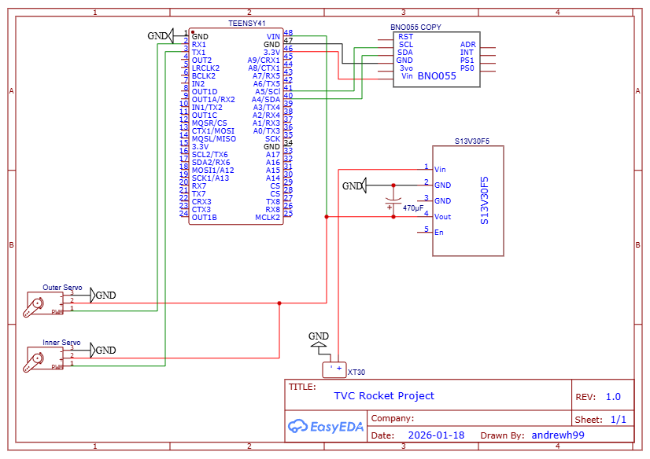

# Teensy 4.1 Thrust Vector Control (TVC) System
**Author:** Andrew Hrisak
**Project Type:** Aerospace Engineering Project | Georgia Institute of Technology

## Overview
This repository contains the flight control software and mechanical design for a custom 2-axis Thrust Vector Control (TVC) gimbal. Utilizing a **Teensy 4.1** and an **Adafruit BNO055 IMU**, the system provides active stabilization for model rocket motors by reacting to gravity vector deflection in real-time.

## Mechanical Design & Manufacturing

### Design for Manufacturing (DfM)
The gimbal assembly was engineered in **SolidWorks** with a focus on optimizing weight-to-strength ratios and part durability under high-vibration aerospace environments.

* **Material Science:** Utilizes **PETG** for its superior impact resistance and thermal stability over PLA, ensuring structural integrity during motor ignition and flight loads.
* **Selective Infill Optimization:**
  * **Structural Components:** 15% infill to minimize rotational inertia, reducing the torque required for high-frequency corrections.
   * **Power Transmission (Gears):** 100% infill to ensure maximum shear strength of gear teeth and to maintain precise mesh under load.
* **Actuation:** Driven by **EMAX ES08MA II** metal-gear micro servos, selected for their superior durability and 2.0 kg/cm stall torque.

### Mechatronic Specifications & Tolerances
* **Controller:** Teensy 4.1 (ARM Cortex-M7 @ 600MHz).
* **IMU:** BNO055 (Absolute Orientation via Gravity Vector).
* **Mechanical Advantage:** * **Lower Axis (Pitch):** 120mm Gear / 24mm Pinion (**5.0:1 Ratio**).
   * **Upper Axis (Yaw):** 166mm Gear / 24mm Pinion (**6.91:1 Ratio**).
* **Precision:** The high reduction ratios significantly increase effective torque and provide high-resolution angular control (approx. 0.14° per servo step on the upper axis).

## System Architecture
### Wiring Schematic

| Component | Pin | Function |
| :--- | :--- | :--- |
| BNO055 SDA | 18 | I2C Data |
| BNO055 SCL | 19 | I2C Clock |
| Lower Servo | 0 | PWM Control |
| Upper Servo | 1 | PWM Control |

## Control Theory
### v1.0: Proportional Feedback
The system utilizes a **Proportional (P) Feedback Loop**. By leveraging the IMU's gravity vector rather than Euler angles, the controller avoids gimbal lock during high-dynamic vertical flight.

**Control Law:**
$$u(t) = K_p \cdot (G_{raw} - G_{offset})$$

Where $K_p$ incorporates the software gain (currently 8.0) and the specific mechanical advantage of each axis.

### v2.0: PID Implementation
**Status: Validation Ongoing.** Testing is currently underway to implement a full **PID controller** to incorporate derivative damping, effectively counteracting angular momentum and reducing oscillations during high-velocity maneuvers.

## Calibration & Validation
To account for mechanical mounting variances, specific offsets are applied to establish a "True Vertical" baseline:
* **Lower Axis (Y) Offset:** 0.50.
* **Upper Axis (Z) Offset:** -0.52.

The firmware includes a **1-second startup safety lock**. During this phase, servos are held at neutral trim positions (**Low: 82.5° / Up: 95.0°**) to allow for physical inspection and sensor stabilization before reactive mode begins.
